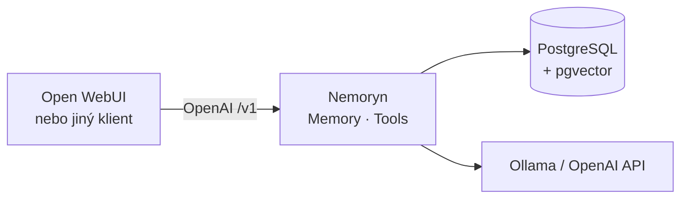
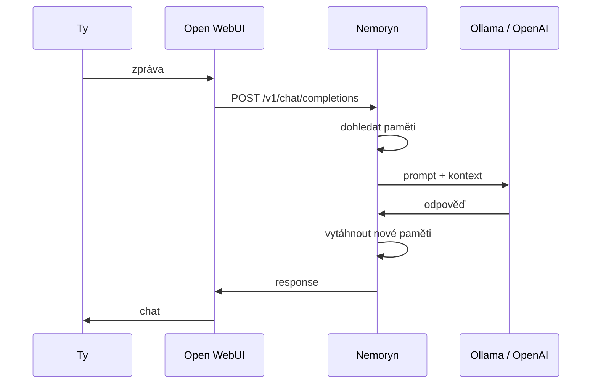
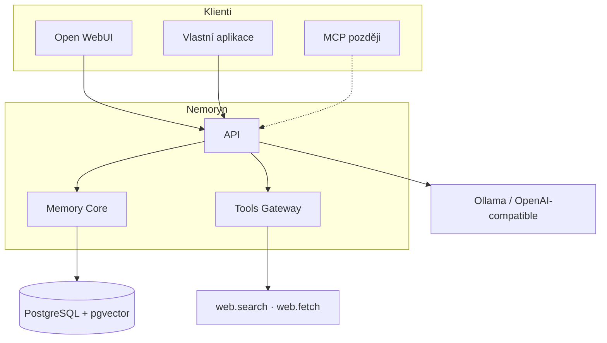

# Nemoryn

[English](README.md) · [**Čeština**](README.cs.md) · [Deutsch](README.de.md)

**Trvalá paměť pro AI asistenty.**

Nemoryn je backend mezi chat klientem a modelem. Není to LLM. Dál používáš Ollama nebo jiného OpenAI-compatible providera. Nemoryn před odpovědí dohledá relevantní paměti a po konverzaci je zase aktualizuje.

<p>
  
  
  
  
</p>



## Proč

Většina modelů zná jen to, co je v aktuálním kontextovém okně. Okno zmizí — zmizí i „paměť“.

Nemoryn drží paměť **mimo** model. Model vyměníš, paměti zůstanou.

**Konverzace 1**

> **Ty:** Ollama mi běží na Mac mini.
>
> Nemoryn to vytáhne a uloží jako dlouhodobou paměť.

**O pár dní později · konverzace 27**

> **Ty:** Kam jsem dal Ollama server?
>
> Nemoryn hledá v paměti a dá zásah do kontextu.
>
> **Asistent:** Ollama ti běží na Mac mini.

## Co umí

- trvalá dlouhodobá paměť
- sémantické vyhledávání (embeddingy)
- PostgreSQL + pgvector
- důležitost, jistota, konflikty, historie
- OpenAI-compatible API `/v1`
- Open WebUI jako chat klient (ne jako host pluginů)
- Tools Gateway (`web.search`, `web.fetch`)
- Ollama i jiní OpenAI-compatible provideři

Paměť, UI a LLM jsou oddělené. Open WebUI je jeden klient. Nemoryn není plugin Open WebUI.

## Jak vypadá request



Z tvé strany jen dál píšeš v Open WebUI.

## Architektura



## Start

**Potřebuješ**

- Docker Desktop (nebo daemon) s `docker compose`
- Ollama nebo OpenAI-compatible API
- chat model a embedding model
- volný port `5022`

Compose mapuje Postgres na hostitele **5433**, aby se nepotkal s lokálním `5432`.

```bash
git clone https://github.com/Mattes22/Nemoryn.git
cd Nemoryn
cp .env.example .env
```

V `.env` nastav aspoň:

```bash
POSTGRES_PASSWORD=your-password
MEMORY_AI_BASE_URL=http://host.docker.internal:11434
MEMORY_AI_CHAT_MODEL=gpt-oss:20b
MEMORY_AI_EMBEDDING_MODEL=nomic-embed-text
```

Ollama na jiném stroji v LAN: `MEMORY_AI_BASE_URL=http://192.168.x.x:11434`.

```bash
docker compose up --build -d
```

Otevři [http://localhost:5022/](http://localhost:5022/). V **Runtime** zkontroluj, že žije databáze i oba modely.

> **Používáš Open WebUI?** Nepřeskoč vlastní hlavičky v
> [nastavení Open WebUI](#open-webui). Nemoryn podle nich pozná uživatele
> a konverzaci — bez nich persistentní paměť nedrží.

V Dockeru je host databáze `postgres`, port **`5432`** (ne `5433`). `5433` je jen mapování na Mac.

```bash
docker compose down          # zastavit
docker compose down -v       # zastavit a smazat volume
```

## Open WebUI

Jdi do:

**Admin → Settings → Connections → OpenAI**

Přidej Nemoryn jako OpenAI-compatible připojení:

| Pole | Hodnota |
|---|---|
| API Base URL | `http://127.0.0.1:5022/v1` |
| API Key | cokoliv, pokud je `NEMORYN_API_KEY` prázdný; jinak ten klíč |

### Povinné hlavičky Open WebUI

Pak v **Advanced** nastavení připojení přidej tyto hlavičky:

```json
{
  "X-OpenWebUI-User-Id": "{{USER_ID}}",
  "X-OpenWebUI-Chat-Id": "{{CHAT_ID}}"
}
```

Tyto hlavičky jsou **povinné** pro persistentní paměť.

`X-OpenWebUI-User-Id` dává Nemorynu stabilní identitu uživatele,
`X-OpenWebUI-Chat-Id` identifikuje aktuální konverzaci. Díky tomu Nemoryn
drží paměti u správného člověka a zároveň ví, ze kterého chatu pocházejí.

Bez těchto hlaviček Nemoryn nedokáže spolehlivě rozlišit uživatele a
konverzace, když requesty přijdou přes Open WebUI.

Celé zapojení vypadá zhruba takto:

```text
Open WebUI
   │
   │ POST /v1/chat/completions
   │
   │ X-OpenWebUI-User-Id: <user>
   │ X-OpenWebUI-Chat-Id: <conversation>
   ▼
Nemoryn
   │
   ├── identify user
   ├── identify conversation
   ├── retrieve relevant memories
   └── build context
   │
   ▼
Configured LLM
```

Chat model a URL Ollamy se nastavují v Nemoryn **Runtime**, ne v Open WebUI.

Pak už chatuješ jako dřív: Open WebUI volá Nemoryn, Nemoryn vytáhne
relevantní paměť a volá nastavený model.

## Tools Gateway

Oddělené od Memory Core. Připravené na Open WebUI, MCP i jiné agenty.

| Nástroj | Účel |
|---|---|
| `web.search` | fulltext na webu (SearXNG) |
| `web.fetch` | veřejná stránka → vyčištěný text (SSRF ochrana) |

- API: [http://localhost:5022/api/v1/tools](http://localhost:5022/api/v1/tools)
- OpenAPI: [http://localhost:5022/openapi/tools.json](http://localhost:5022/openapi/tools.json)
- Konzole: **Tools** → SearXNG Base URL

Víc: [`docs/tools.cs.md`](docs/tools.cs.md)

## Konzole

[http://localhost:5022/](http://localhost:5022/) — runtime, paměti, kandidáti, konflikty, audit, Tools.

Nemá přihlášení. `5022` na veřejný internet bez proxy/VPN nepouštěj.

## Čím Nemoryn není

- **není LLM** — pořád potřebuješ Ollama nebo jiného providera
- **není chat UI** — front end je Open WebUI (nebo vlastní klient)
- **není navázaný na jeden model** — paměť zůstane při výměně modelu i klienta

## Stav

Aktivní vývoj. Rozdělené tak, aby memory engine obsloužil Open WebUI, vlastní asistenty, lokální agenty, MCP i jiné OpenAI-compatible aplikace.

Teď: spolehlivá paměť, retrieval a nástroje.

## Bezpečnost

- Konzole nemá login — `5022` neveřejni
- `.env` a `memory-*.connection.json` se necommitují
- `web.fetch` blokuje loopback, link-local a privátní sítě
- Nástroje jdou přes capabilities

## Dokumentace

- [Docker](docs/docker.cs.md)
- [Open WebUI](docs/openwebui.cs.md)
- [Tools Gateway](docs/tools.cs.md)

## Přispívání

Open source a pořád se vyvíjí. Bug reporty, nápady, architektura i PR jsou vítané.
