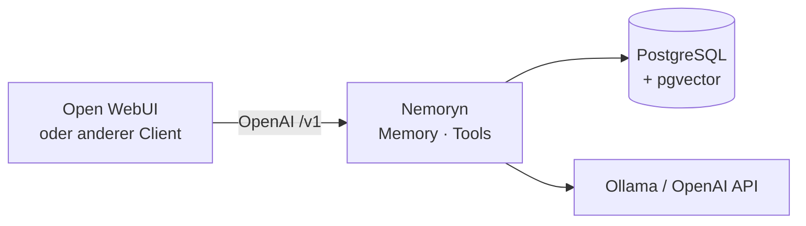
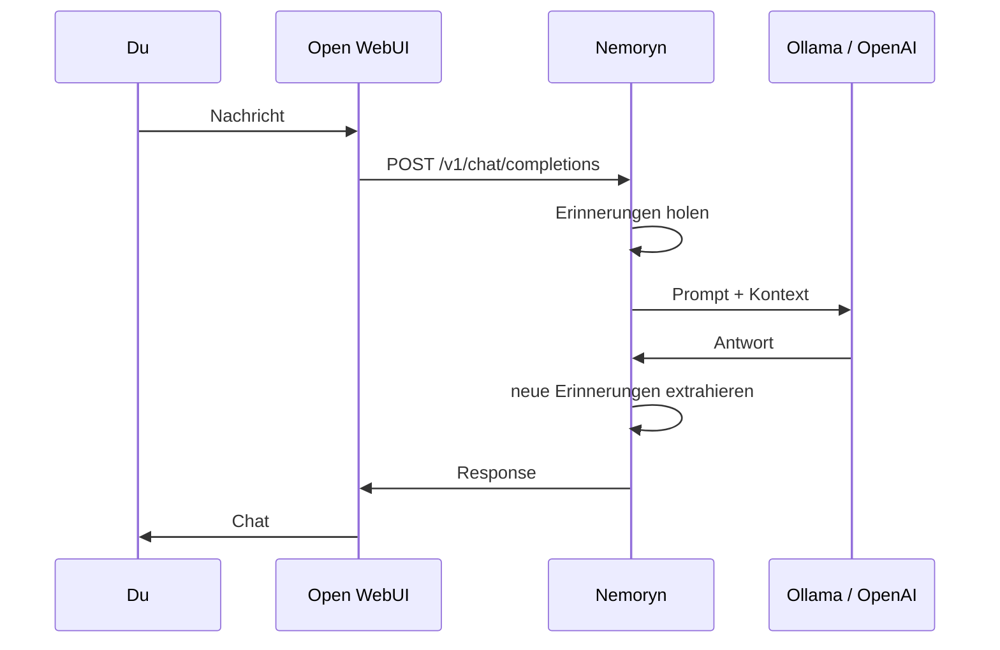
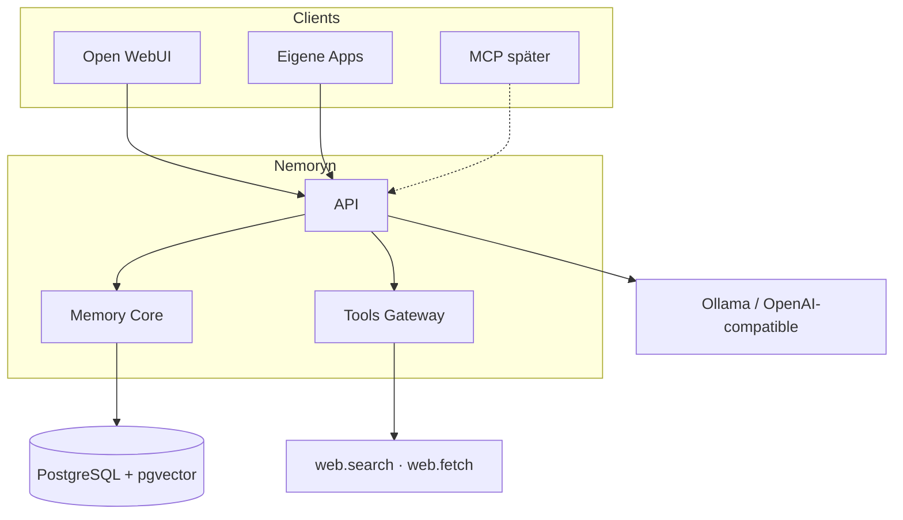

# Nemoryn

[English](README.md) · [Čeština](README.cs.md) · [**Deutsch**](README.de.md)

**Persistenter Speicher für KI-Assistenten.**

Nemoryn ist ein Backend zwischen Chat-Client und Modell. Es ist kein LLM. Du nutzt weiter Ollama oder einen anderen OpenAI-kompatiblen Provider. Nemoryn holt vor der Antwort passende Erinnerungen und aktualisiert das Langzeitgedächtnis danach.

<p>
  
  
  
  
</p>



## Warum

Die meisten Modelle kennen nur das aktuelle Kontextfenster. Ist das Fenster weg, ist auch das „Gedächtnis“ weg.

Nemoryn hält Speicher **außerhalb** des Modells. Modell wechseln, Erinnerungen behalten.

**Unterhaltung 1**

> **Du:** Mein Ollama-Server läuft auf dem Mac mini.
>
> Nemoryn zieht das raus und speichert es als Langzeitgedächtnis.

**Tage später · Unterhaltung 27**

> **Du:** Wo habe ich den Ollama-Server hingestellt?
>
> Nemoryn sucht im Speicher und legt den Treffer in den Kontext.
>
> **Assistent:** Dein Ollama-Server läuft auf deinem Mac mini.

## Was es kann

- persistentes Langzeitgedächtnis
- semantische Suche (Embeddings)
- PostgreSQL + pgvector
- Wichtigkeit, Konfidenz, Konflikte, Historie
- OpenAI-kompatible `/v1`-API
- Open WebUI als Chat-Client (kein Plugin-Host)
- Tools Gateway (`web.search`, `web.fetch`)
- Ollama und andere OpenAI-kompatible Provider

Speicher, UI und LLM bleiben lose gekoppelt. Open WebUI ist ein Client. Nemoryn ist kein Open-WebUI-Plugin.

## Ablauf einer Anfrage



Aus deiner Sicht chattest du einfach weiter in Open WebUI.

## Architektur



## Schnellstart

**Du brauchst**

- Docker Desktop (oder einen Daemon) mit `docker compose`
- Ollama oder eine OpenAI-kompatible API
- Chat-Modell und Embedding-Modell
- freien Port `5022`

Compose mappt Postgres auf Host-Port **5433**, damit es nicht mit lokalem `5432` kollidiert.

```bash
git clone https://github.com/Mattes22/Nemoryn.git
cd Nemoryn
cp .env.example .env
```

In `.env` mindestens setzen:

```bash
POSTGRES_PASSWORD=your-password
MEMORY_AI_BASE_URL=http://host.docker.internal:11434
MEMORY_AI_CHAT_MODEL=gpt-oss:20b
MEMORY_AI_EMBEDDING_MODEL=nomic-embed-text
```

Ollama auf einem anderen Rechner im LAN: `MEMORY_AI_BASE_URL=http://192.168.x.x:11434`.

```bash
docker compose up --build -d
```

Öffne [http://localhost:5022/](http://localhost:5022/). Unter **Runtime** prüfen, ob Datenbank und beide Modelle leben.

> **Open WebUI?** Überspring die Custom Headers in der
> [Open-WebUI-Konfiguration](#open-webui) nicht. Nemoryn braucht sie, um
> Benutzer und Konversation für persistente Erinnerung zu erkennen.

In Docker ist der Datenbank-Host `postgres`, Port **`5432`** (nicht `5433`). `5433` ist nur das Mapping auf den Mac.

```bash
docker compose down          # stoppen
docker compose down -v       # stoppen und Volumes löschen
```

## Open WebUI

Geh zu:

**Admin → Settings → Connections → OpenAI**

Füge Nemoryn als OpenAI-kompatible Verbindung hinzu:

| Feld | Wert |
|---|---|
| API Base URL | `http://127.0.0.1:5022/v1` |
| API Key | beliebig, wenn `NEMORYN_API_KEY` leer ist; sonst derselbe Schlüssel |

### Pflicht-Header für Open WebUI

Öffne danach die **Advanced**-Einstellungen der Verbindung und füge diese Header hinzu:

```json
{
  "X-OpenWebUI-User-Id": "{{USER_ID}}",
  "X-OpenWebUI-Chat-Id": "{{CHAT_ID}}"
}
```

Diese Header sind für persistente Erinnerung **pflicht**.

`X-OpenWebUI-User-Id` gibt Nemoryn eine stabile Benutzeridentität,
`X-OpenWebUI-Chat-Id` identifiziert die aktuelle Konversation. So bleiben
Erinnerungen dem richtigen Benutzer zugeordnet und gleichzeitig der Chat
nachvollziehbar, aus dem sie stammen.

Ohne diese Header kann Nemoryn Benutzer und Konversationen nicht zuverlässig
unterscheiden, wenn die Requests über Open WebUI kommen.

Die Verbindung sieht grob so aus:

```text
Open WebUI
   │
   │ POST /v1/chat/completions
   │
   │ X-OpenWebUI-User-Id: <user>
   │ X-OpenWebUI-Chat-Id: <conversation>
   ▼
Nemoryn
   │
   ├── identify user
   ├── identify conversation
   ├── retrieve relevant memories
   └── build context
   │
   ▼
Configured LLM
```

Chat-Modell und Ollama-URL setzt du in Nemoryn **Runtime**, nicht in
Open WebUI.

Danach chattest du wie gewohnt: Open WebUI spricht mit Nemoryn, Nemoryn
holt die passende Erinnerung und spricht mit dem konfigurierten Modell.

## Tools Gateway

Unabhängig vom Memory Core. Gedacht für später Open WebUI, MCP und andere Agenten.

| Tool | Zweck |
|---|---|
| `web.search` | Volltextsuche im Web (SearXNG) |
| `web.fetch` | öffentliche Seite → bereinigter Text (SSRF-sicher) |

- API: [http://localhost:5022/api/v1/tools](http://localhost:5022/api/v1/tools)
- OpenAPI: [http://localhost:5022/openapi/tools.json](http://localhost:5022/openapi/tools.json)
- Konsole: **Tools** → SearXNG Base URL

Details: [`docs/tools.de.md`](docs/tools.de.md)

## Konsole

[http://localhost:5022/](http://localhost:5022/) — Runtime, Erinnerungen, Kandidaten, Konflikte, Audit, Tools.

Kein Login. `5022` nicht ohne Proxy/VPN ins öffentliche Internet legen.

## Was Nemoryn nicht ist

- **kein LLM** — du brauchst weiter Ollama oder einen anderen Provider
- **kein Chat-UI** — Front-End ist Open WebUI (oder dein eigener Client)
- **nicht an ein Modell gebunden** — Speicher bleibt beim Wechsel von Modell oder Client

## Status

Aktive Entwicklung. So geschnitten, dass die Memory-Engine Open WebUI, eigene Assistenten, lokale Agenten, MCP und andere OpenAI-kompatible Apps bedienen kann.

Fokus jetzt: zuverlässiger Speicher, Retrieval und Tools.

## Sicherheit

- Die Konsole hat kein Login — `5022` nicht öffentlich machen
- `.env` und `memory-*.connection.json` werden nicht committet
- `web.fetch` blockiert Loopback, Link-Local und private Netze
- Tools laufen über Capabilities

## Dokumentation

- [Docker](docs/docker.de.md)
- [Open WebUI](docs/openwebui.de.md)
- [Tools Gateway](docs/tools.de.md)

## Mitwirken

Open Source und noch im Aufbau. Bugreports, Ideen, Architektur-Notizen und PRs sind willkommen.
