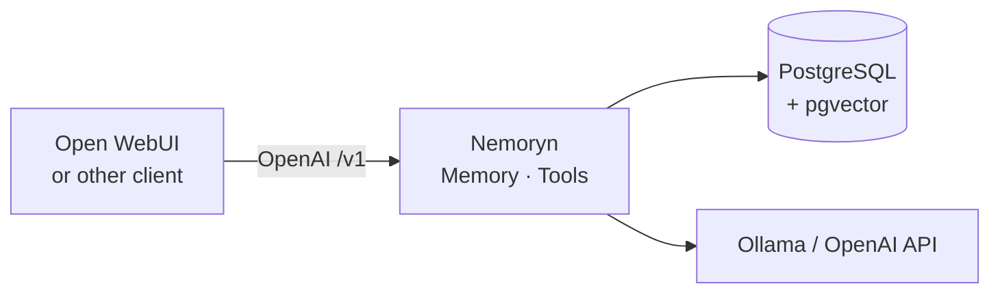
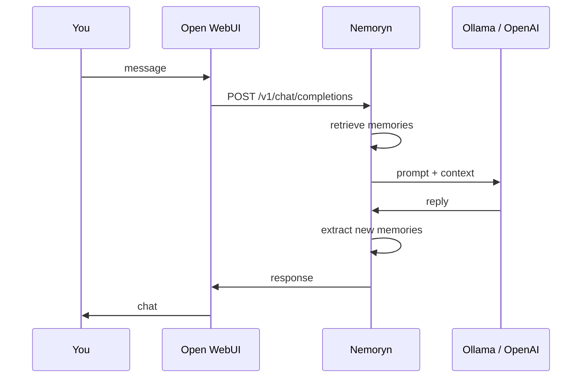
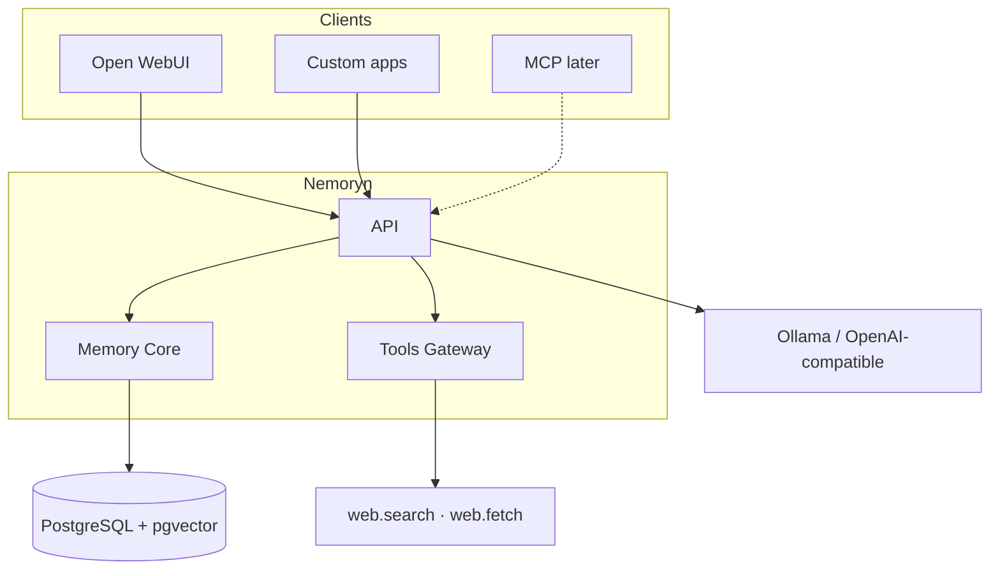

# Nemoryn

[**English**](README.md) · [Čeština](README.cs.md) · [Deutsch](README.de.md)

**Persistent memory for AI assistants.**

Nemoryn is a backend between your chat client and your model. It is not an LLM. You keep using Ollama or another OpenAI-compatible provider. Nemoryn retrieves relevant memories before a reply and updates long-term memory afterwards.

<p>
  
  
  
  
</p>



## Why

Most models only know what is in the current context window. When that window is gone, so is everything they “remembered”.

Nemoryn keeps memory **outside** the model. Change the LLM, keep the memories.

**Conversation 1**

> **You:** My Ollama server runs on my Mac mini.
>
> Nemoryn extracts that and stores it as long-term memory.

**Days later · conversation 27**

> **You:** Where did I put my Ollama server?
>
> Nemoryn searches memory, puts the hit in context.
>
> **Assistant:** Your Ollama server runs on your Mac mini.

## What it does

- Persistent long-term memory
- Semantic retrieval (embeddings)
- PostgreSQL + pgvector
- Importance, confidence, conflicts, history
- OpenAI-compatible `/v1` API
- Open WebUI as a chat client (not a plugin host)
- Tools Gateway (`web.search`, `web.fetch`)
- Ollama and other OpenAI-compatible providers

Memory, UI, and the LLM stay loosely coupled. Open WebUI is one client. Nemoryn is not an Open WebUI plugin.

## How a request works



From your side you just keep chatting in Open WebUI.

## Architecture



## Quick start

**You need**

- Docker Desktop (or a daemon) with `docker compose`
- Ollama or an OpenAI-compatible API
- a chat model and an embedding model
- port `5022` free

Compose maps Postgres to host port **5433** so it does not clash with local `5432`.

```bash
git clone https://github.com/Mattes22/Nemoryn.git
cd Nemoryn
cp .env.example .env
```

In `.env` set at least:

```bash
POSTGRES_PASSWORD=your-password
MEMORY_AI_BASE_URL=http://host.docker.internal:11434
MEMORY_AI_CHAT_MODEL=gpt-oss:20b
MEMORY_AI_EMBEDDING_MODEL=nomic-embed-text
```

Ollama on another machine on the LAN: `MEMORY_AI_BASE_URL=http://192.168.x.x:11434`.

```bash
docker compose up --build -d
```

Open [http://localhost:5022/](http://localhost:5022/). In **Runtime**, check that the database and both models are live.

Inside Docker the database host is `postgres`, port **`5432`** (not `5433`). `5433` is only the mapping onto your Mac.

```bash
docker compose down          # stop
docker compose down -v       # stop and delete volumes
```

## Open WebUI

Admin → Settings → Connections → OpenAI:

| Field | Value |
|---|---|
| API Base URL | `http://127.0.0.1:5022/v1` |
| API Key | anything if `NEMORYN_API_KEY` is empty; otherwise that key |

Chat model and Ollama URL live in Nemoryn **Runtime**, not in Open WebUI. After that, chat as usual: Open WebUI talks to Nemoryn, Nemoryn talks to the model.

## Tools Gateway

Independent of Memory Core. Built for later Open WebUI / MCP / other agents.

| Tool | What it does |
|---|---|
| `web.search` | Full-text web search (SearXNG) |
| `web.fetch` | Public page → cleaned text (SSRF-safe) |

- API: [http://localhost:5022/api/v1/tools](http://localhost:5022/api/v1/tools)
- OpenAPI: [http://localhost:5022/openapi/tools.json](http://localhost:5022/openapi/tools.json)
- Console: **Tools** → SearXNG Base URL

Details: [`docs/tools.md`](docs/tools.md)

## Console

[http://localhost:5022/](http://localhost:5022/) — runtime, memories, candidates, conflicts, audit, Tools.

No login. Do not expose `5022` to the public internet without a proxy, VPN, or similar.

## What Nemoryn is not

- **Not an LLM** — you still need Ollama or another provider
- **Not a chat UI** — Open WebUI (or your own client) is the front end
- **Not tied to one model** — memory stays when you switch models or clients

## Status

Active development. Split so the memory engine can serve Open WebUI, custom assistants, local agents, MCP, and other OpenAI-compatible apps.

Focus now: reliable memory, retrieval, and tools.

## Security

- Console has no login — do not publish `5022`
- `.env` and `memory-*.connection.json` are not committed
- `web.fetch` blocks loopback, link-local, and private networks
- Tools are capability-based

## Docs

- [Docker](docs/docker.md)
- [Open WebUI](docs/openwebui.md)
- [Tools Gateway](docs/tools.md)

## Contributing

Open source and still evolving. Bug reports, ideas, architecture notes, and PRs are welcome.
